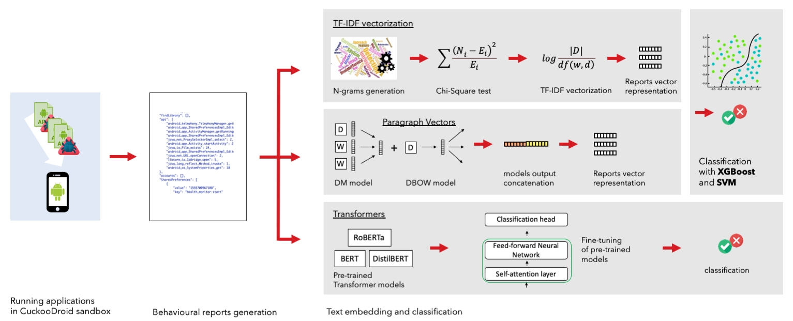

# Semantics-aware Android Malware detector

The implementation of malware detection system proposed for the thesis *Semantics-aware Malware Detectionusing Natural Language Processing techniques on behavioural analysis*.

## 1. Overview
The aim is to develop a generic malware detection tool which will be able to recognise malware based on behavioural reports generated during dynamic and static analysis of Android applications. System implements either language models based on Transformer architecture but also more conventional embedding methods such as TF-IDF and Paragraph Vectors with the aim to compare their results and prove their suitability for malware detection.

Following figure shows the system overview. Behavioral reports are generated separately in [CuckooDroid](https://github.com/idanr1986/cuckoo-droid) sandbox and then passed to the system for classification.



## 2. Installation

System is implemented with Python 3, using libraries specified in `requirements.txt`. To install dependencies, run:
```
pip3 install -r requirements.txt
```

### 2.1. Download pre-trained models

To use already pre-trained models, go to the following [link](https://drive.google.com/drive/folders/1Cpjz8K9qECveHS_lKQKrHsLDpXOum1f3?usp=sharing) and choose models, you wish to use:
1. Download models
2. unzip it and paste it to `saved_models/` directory

## 3. Operation modes

System works in two operation modes. The user can either train and evaluate the models on a dataset of behavioural reports or run a classification of a single report with one of the pre-trained models.

### 3.1. Training and evaluation mode

Script `train_evaluate_model.py` can be used for training and evaluation of models based on the dataset of behavioural reports.
The absolute path to dataset needs to be supplied in JSON format, specified by `--dataset_path` parameter. 
Requested embedding and classification method can be selected. Parameters `--train_emb` and `--train_cls` allow to control, whether new text embedding (TF-IDF, Paragraph Vectors) and classification models (SVM, XGBoost) are trained or whether already trained models are used for prediction on test dataset. To specify one of the Transformer models, only `--embedding` and `--train_emb` parameters are required. List of all parameters can be found in table.

| Argument        | Description           | Value |
| ------------- |:-------------:|:-------------:|
| --dataset_path      | Absolute path to dataset of behavioural reports | \<PATH\> |
| --output_dir      | Absolute path to the directory, containing models | \<PATH\> |
| --embedding | Requested embedding model | \<tfidf,doc2vec,bert, roberta,distilbert\> |
| --classifier | Requested classifier for TF-IDF and Doc2Vec embedding | \<svc,xgb\> |
| --train_emb | Mark, whether to train new model, or use already trained one from output dir | |
| --train_cls | Mark, whether to train new classifier, or use already trained one from output dir | |

To train a new XGBoost classifier with TF-IDF embedding, run following command:
```
python3 train_evaluate_model.py --dataset_path <path_to_dataset> --output_dir <path_to_models> --embedding tfidf --classifier xgboost --train_emb --train_cls
```

#### 3.1.1. Create reports dataset

To create a JSON dataset from behavioral reports, script `downloader.py` can be used. Generated reports in report_dir needs to be split to subdirectories, so that benign reports are in different subdirectory than malware reports. Names of benign subdirectories can be specified in `dowloader.py`. Script then pre-process the reports and save them to JSON file, which can be used in a system.
```
reports_dir
└── benign_1
└── benign_2
└── malware_1
└── malware_2
    └── report_1
    └── report_2
```


### 3.2. Report Classification

Script `predict_report.py` allows conducting a classification of a single behavioural report. To conduct this operation, the directory, specified by argument `--output_dir`, needs to contain trained models. 
The report's absolute path is supplied by argument `--report_path`. Requested embedding and classification method is selected by parameters `--embedding` and `--classifier`. List of all args can be found in table.

| Argument        | Description           | Value |
| ------------- |:-------------:|:-------------:|
| --report_path      | Absolute path to behavioural report | \<PATH\> |
| --output_dir      | Absolute path to the directory, containing models | \<PATH\> |
| --embedding | Requested embedding model | \<tfidf,doc2vec,bert, roberta,distilbert\> |
| --classifier | Requested classifier for TF-IDF and Doc2Vec embedding | \<svc,xgb\> |

To classify a report with XGBoost classifier and TF-IDF embedding, simply run:
```
python3 predict_report.py --report_path <path_to_report> --output_dir <path_to_models> --embedding tfidf --classifier xgboost
```


